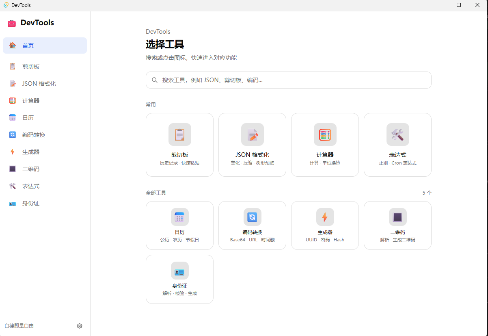
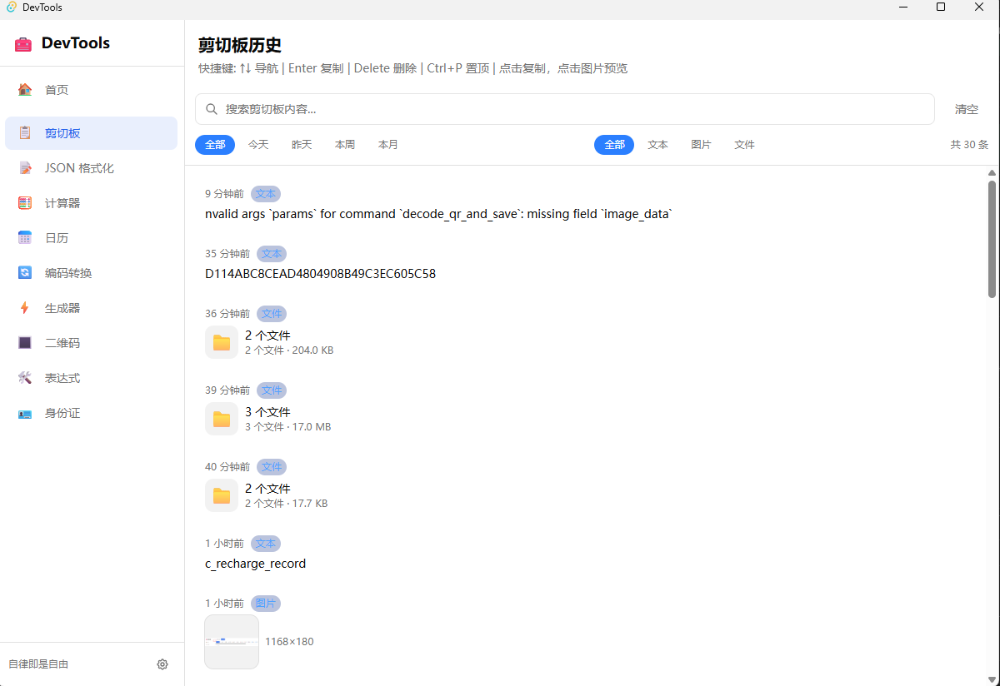
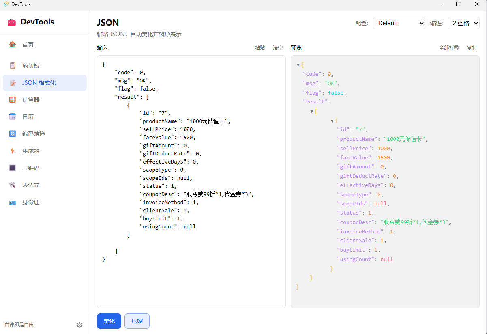
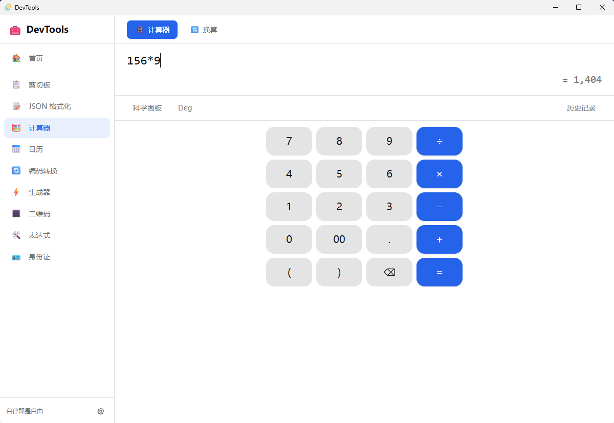
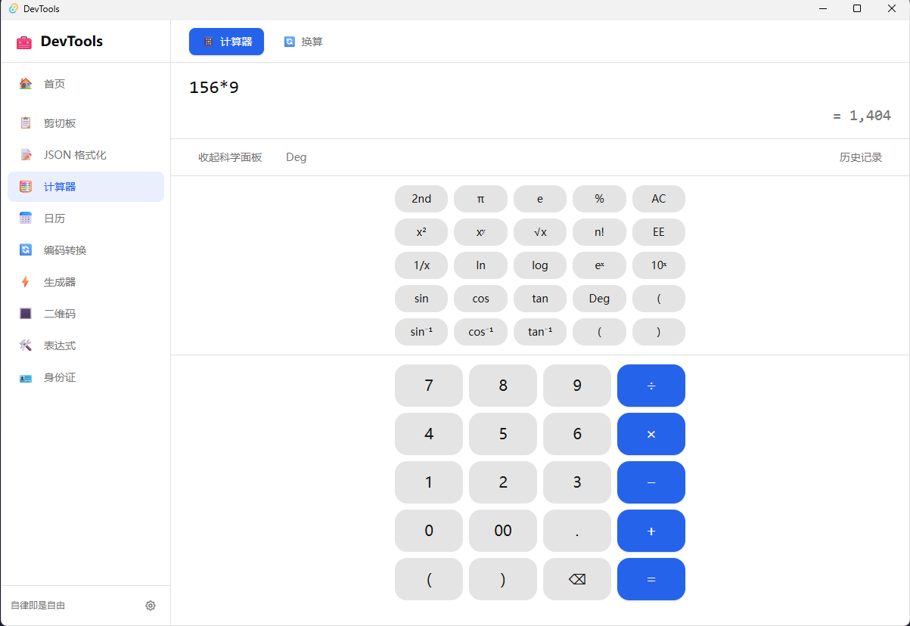
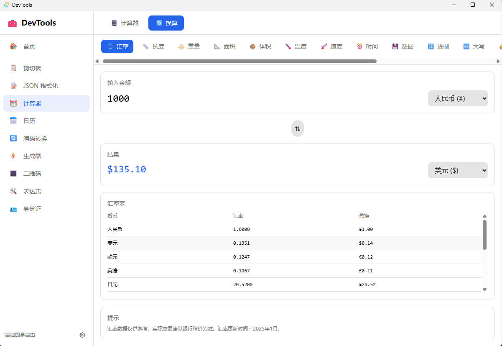
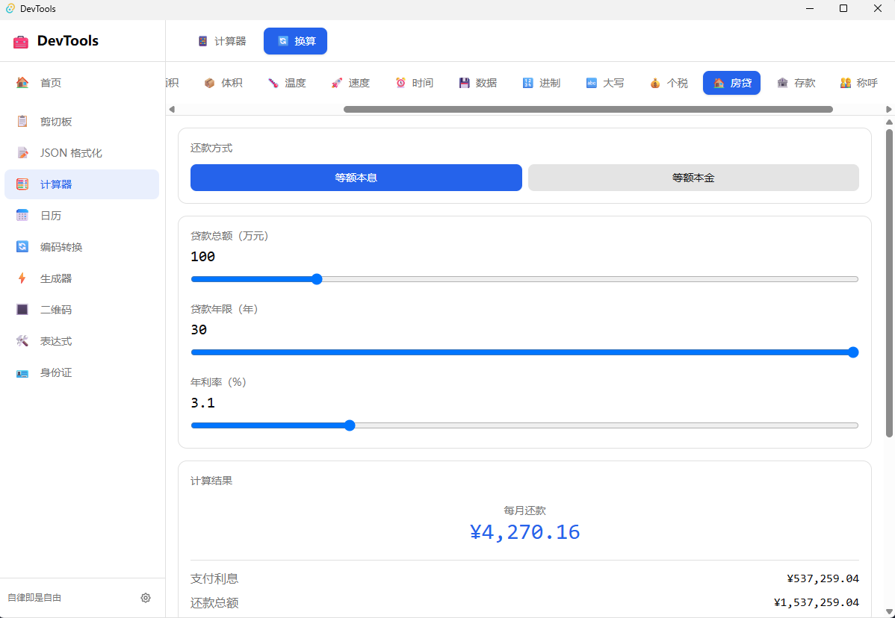
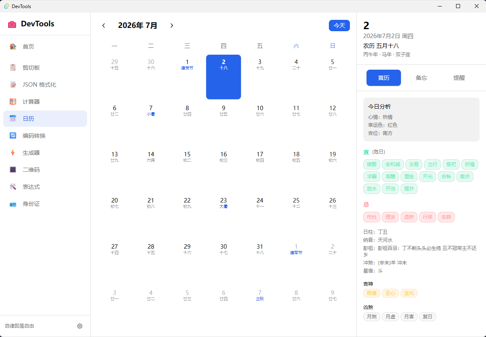
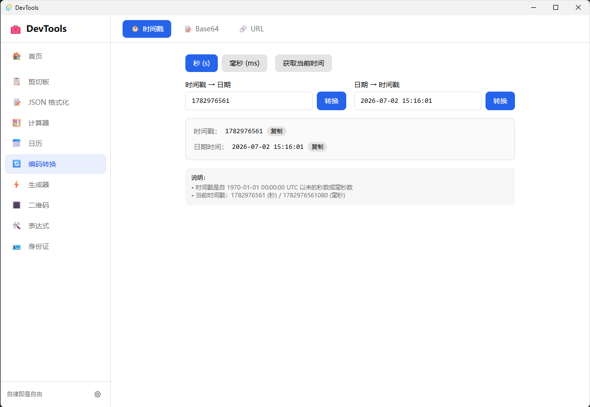

# Dev Tools · 开发者工具箱

基于 **Tauri 2 + React 19 + TypeScript** 的跨平台桌面开发者工具集，集成 JSON 格式化、剪切板历史、计算器、日历、编码转换、生成器、正则/Cron 等常用功能。

[](https://github.com/caojiabin2012/dev-tools/releases)
[](https://gitee.com/caojiabin/dev-tools)
[](LICENSE)

## 功能概览

| 模块 | 说明 |
|------|------|
| 首页 | 搜索 + 常用工具快捷入口 + 全部工具网格 |
| JSON 格式化 | 格式化 / 压缩 / 树形预览 / 多主题配色 |
| 剪切板 | 文本·图片·文件历史，搜索筛选，OCR，GIF 支持 |
| 计算器 | 科学计算 + 长度/重量/汇率等 20+ 单位换算 |
| 日历 | 公历·农历·黄历·备忘·提醒 |
| 编码工具 | 时间戳、Base64、URL 编解码 |
| 生成工具 | UUID、随机密码、Hash |
| 身份证工具 | 解析、校验、生成 |
| 开发工具 | 正则测试、Cron 表达式 |
| 设置 | 开机自启、托盘、快捷键、自动更新 |

详细开发文档见 [`doc/`](doc/) 目录。

## 界面预览

### 首页

搜索工具、常用入口与全部工具一览。



### JSON 格式化

双栏输入输出，语法高亮树形展示，支持配色与缩进切换。



### 剪切板历史

自动记录复制历史，支持文本/图片/文件筛选、搜索、置顶与 OCR。



### 计算器

标准/科学计算，Deg/Rad 切换，历史记录。



### 单位换算

汇率、长度、重量、温度等 20+ 换算类型。



### 日历

公历农历对照，黄历宜忌，备忘与提醒。



### 编码工具

时间戳与日期互转（上海时区），Base64、URL 编解码。



### 生成工具

随机密码（强度评估）、UUID 批量生成。



### 开发工具

正则表达式测试（常用预设 + 高亮匹配），Cron 表达式解析。



## 技术栈

- **前端**：React 19 · TypeScript · Tailwind CSS v4 · Vite 8
- **桌面**：Tauri 2 · Rust
- **存储**：SQLite（剪切板历史）
- **OCR**：Windows Media OCR（WinRT）
- **更新**：`tauri-plugin-updater` + GitHub Releases

## 快速开始

### 环境要求

- Node.js 18+
- pnpm 9+
- Rust 1.77+
- [Tauri 前置依赖](https://v2.tauri.app/start/prerequisites/)

### 安装与开发

```bash
pnpm install
pnpm tauri dev      # 桌面开发模式
pnpm dev            # 仅前端
```

### 构建安装包

```bash
pnpm tauri build
```

产物位于 `src-tauri/target/release/bundle/`：

- Windows：`msi/` · `nsis/`
- macOS：`dmg/` · `macos/*.tar.gz`
- Linux：`deb/` · `appimage/`

### 下载

前往 [Releases](https://github.com/caojiabin2012/dev-tools/releases) 下载最新版安装包。

## 快捷键与托盘

| 操作 | 说明 |
|------|------|
| `Ctrl+Shift+V` | 显示/隐藏主窗口（可在设置中修改） |
| 左键单击托盘 | 切换窗口显示/隐藏 |
| 右键托盘 | 显示窗口 / 退出 |
| 关闭按钮 | 默认最小化到托盘 |

## 数据目录

应用数据保存在 `%LOCALAPPDATA%\dev-tools\`：

- `settings.json` — 应用设置
- `clipboard.db` — 剪切板历史
- `crash.log` — 崩溃诊断日志

## 项目结构

```
dev-tools/
├── src/                  # React 前端
│   ├── components/       # 各功能模块 UI
│   └── lib/              # API、Hook、工具函数
├── src-tauri/            # Tauri Rust 后端
├── doc/                  # 功能开发文档
│   └── imgs/             # 界面截图
├── release-notes/        # 版本更新说明
└── .github/workflows/    # CI 构建与发布
```

## 更新日志

见 [CHANGELOG.md](CHANGELOG.md)。

## 许可证

MIT License
